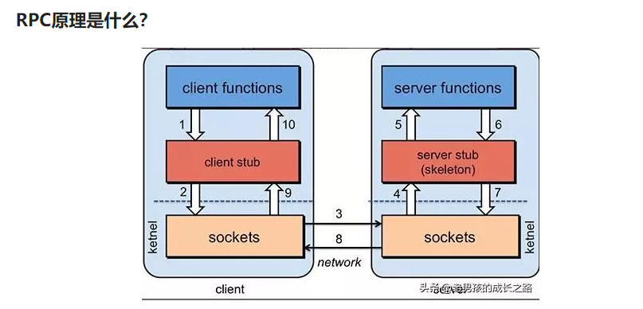
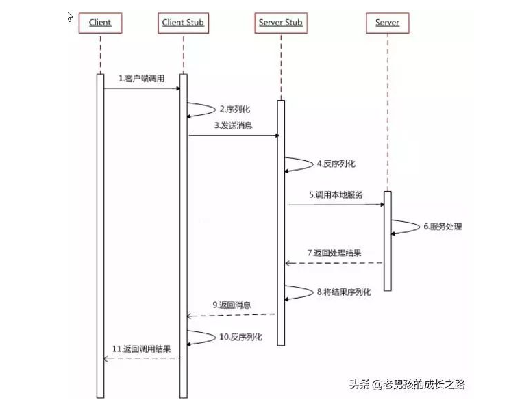

### RPC

RPC(Remote Procedure Call)：远程过程调用，它是一种通过网络从远程计算机程序上请求服务，儿不需要了解底层网络技术的思想。

1. 服务消费方（client）调用以本地调用方式调用服务；
2. client stub接收到调用后负责将方法、参数等组装成能够进行网络传输的消息体；
3. client stub找到服务地址，并将消息发送到服务端；
4. server stub收到消息后进行解码；
5. server stub根据解码结果调用本地的服务；
6. 本地服务执行并将结果返回给server stub；
7. server stub将返回结果打包成消息并发送至消费方；
8. client stub接收到消息，并进行解码；
9. 服务消费方得到最终结果。

## 既有 HTTP ,为啥用 RPC 进行服务调用?

### RPC 只是一种设计而已

RPC 只是一种概念、一种设计，就是为了解决 **不同服务之间的调用问题**, 它一般会包含有 **传输协议** 和 **序列化协议** 这两个。

实现 RPC 的可以传输协议可以直接建立在 TCP 之上，也可以建立在 HTTP 协议之上。**大部分 RPC 框架都是使用的 TCP 连接（gRPC使用了HTTP2）。**

### HTTP 和 TCP

http属于应用层，**应用层(application-layer）的任务是通过应用进程间的交互来完成特定网络应用。**HTTP 属于应用层协议，它会基于TCP/IP通信协议来传递数据（HTML 文件, 图片文件, 查询结果等）。HTTP协议工作于客户端-服务端架构为上。浏览器作为HTTP客户端通过 URL 向HTTP服务端即WEB服务器发送所有请求。Web服务器根据接收到的请求后，向客户端发送响应信息。HTTP协议建立在 TCP 协议之上

TCP属于运输层，**的主要任务就是负责向两台主机进程之间的通信提供通用的数据传输服务**。TCP是传输层协议，主要解决数据如何在网络中传输。相比于UDP,**TCP** 提供的是**面向连接**的，**可靠的**数据传输服务。

**使用自定义 TCP 协议进行传输就会避免上面这个问题，极大地减轻了传输数据的开销。** 这也就是为什么通常会采用自定义 TCP 协议的 RPC 来进行进行服务调用的真正原因。除此之外，成熟的 RPC 框架还提供好了“服务自动注册与发现”、"智能负载均衡"、“可视化的服务治理和运维”、“运行期流量调度”等等功能，这些也算是选择 RPC 进行服务注册和发现的一方面原因吧！

首先要否认一点 HTTP 协议相较于自定义 TCP 报文协议，增加的开销在于连接的建立与断开。HTTP 协议是支持连接池复用的，也就是建立一定数量的连接不断开，并不会频繁的创建和销毁连接。二一要说的是 HTTP 也可以使用 Protobuf 这种二进制编码协议对内容进行编码，因此二者最大的区别还是在传输协议上。

https://www.modb.pro/db/15215

**RPC框架好处**

http接口是在接口不多、系统与系统交互较少的情况下，解决信息孤岛初期常使用的一种通信手段；

优点就是简单、直接、开发方便。

如果是一个大型的网站，内部子系统较多、接口非常多的情况下，RPC框架的好处就显示出来了：

首先就是长链接，不必每次通信都要像http一样去3次握手什么的，减少了网络开销；

其次就是RPC框架一般都有注册中心，有丰富的监控管理；发布、下线接口、动态扩展等，对调用方来说是无感知、统一化的操作。

最后是安全性。

**RPC能解耦服务**

RPC:远程过程调用。RPC的核心并不在于使用什么协议。RPC的目的是让你在本地调用远程的方法，而对你来说这个调用是透明的，你并不知道这个调用的方法是部署哪里。

**通过RPC能解耦服务，这才是使用RPC的真正目的**。RPC的原理主要用到了动态代理模式，至于**http协议，只是传输协议而已**。简单的实现可以参考spring remoting，复杂的实现可以参考dubbo。

